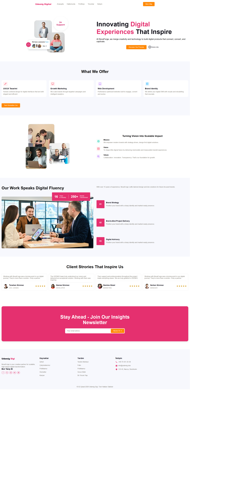

# 🚀 DigiApp SassPro

Modern ve Responsive Web Uygulaması

## 📋 Özellikler

- ✨ **Modern Tasarım** - Güncel ve şık kullanıcı arayüzü
- 📱 **Responsive** - Tüm cihazlarda mükemmel görünüm
- 🎨 **SCSS** - Modüler ve organize CSS yapısı
- 🚀 **Optimize** - Hızlı yüklenme ve performans

## 🛠️ Teknolojiler


- HTML5
- CSS3 / SCSS
- Remix Icon kütüphanesi
- Live Sass Compiler

## 📁 Proje Yapısı

```
digiapp-sasspro/
│
├── assets/
│   ├── about.png
│   ├── feedback-1.jpg
│   ├── feedback-2.jpg
│   ├── feedback-3.jpg
│   ├── feedback-4.jpg
│   ├── hero.png
│   ├── logo.avif
│   └── portfolio.jpg
│
├── styles/
│   ├── _about.scss
│   ├── _feedback.scss
│   ├── _footer.scss
│   ├── _header.scss
│   ├── _hero.scss
│   ├── _mixin.scss
│   ├── _newsletter.scss
│   ├── _portfolio.scss
│   ├── _reset.scss
│   ├── _service.scss
│   ├── _variables.scss
│   ├── style.scss
│   ├── style.css
│   └── style.css.map
│
├── index.html
├── digiapp.gif
└── digiapp.png
```

## 🚀 Kurulum

```bash
# Projeyi klonlayın
git clone https://github.com/kenansonmez1617-hub/digiapp-sasspro.git

# Proje dizinine gidin
cd digiapp-sasspro

# index.html dosyasını tarayıcıda açın
```

## 💻 Geliştirme

SCSS dosyalarını düzenlemek için:

1. VS Code'da Live Sass Compiler eklentisini yükleyin
2. `styles/style.scss` dosyasını açın
3. "Watch Sass" butonuna tıklayın
4. SCSS dosyalarınızı düzenleyin, otomatik olarak CSS'e derlenecektir

## 📸 Proje Önizleme



## ⚙️ Canlı Demo


## 🎨 SCSS Modülleri

| Dosya | Açıklama |
|-------|----------|
| `_variables.scss` | Renk, font ve genel değişkenler |
| `_mixin.scss` | Tekrar kullanılabilir SCSS mixin'leri |
| `_reset.scss` | CSS reset ve temel stiller |
| `_header.scss` | Header/navigasyon stilleri |
| `_hero.scss` | Ana banner/hero bölümü |
| `_about.scss` | Hakkında bölümü |
| `_service.scss` | Hizmetler bölümü |
| `_portfolio.scss` | Portfoy bölümü |
| `_feedback.scss` | Geri bildirim/yorumlar bölümü |
| `_newsletter.scss` | Bülten abonelik bölümü |
| `_footer.scss` | Footer stilleri |

## 🤝 Katkıda Bulunma

1. Bu depoyu fork edin
2. Yeni bir branch oluşturun (`git checkout -b feature/yeniOzellik`)
3. Değişikliklerinizi commit edin (`git commit -am 'Yeni özellik eklendi'`)
4. Branch'inizi push edin (`git push origin feature/yeniOzellik`)
5. Pull Request oluşturun

---

## 🌟 Destek

Projeyi beğendiyseniz ⭐ vermeyi unutmayın!

<div align="center">
  <em>Son Güncelleme: 06 Şubat 2026</em><br>
  Made with ❤️ by Kenan Sönmez
</div>
